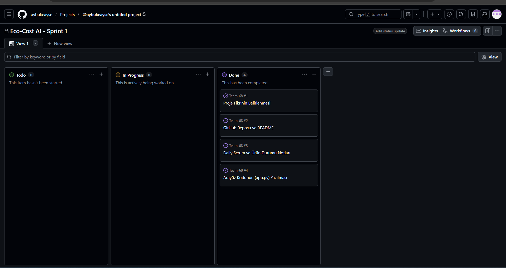

# Team-68

Ürün İle İlgili Bilgiler

Takım Elemanları:

*Product Owner: Aybüke Hamzaçebi
*Scrum Master: Aybüke Hamzaçebi
*Developer: Aybüke Hamzaçebi

Ürün İsmi:
*Eco-Cost AI 

Ürün Açıklaması:
*Eco-Cost AI, şirketlerin üretim verilerine dayanarak gelecekteki karbon emisyonlarını ve olası karbon vergisi/ceza maliyetlerini tahmin eden makine öğrenmesi destekli bir veri panelidir.

Ürün Özellikleri:

* İşletmelerin aylık enerji (elektrik, doğalgaz vb.) tüketim verilerini sisteme girebilmesi
* Girilen veriler üzerinden anlık karbon ayak izi (emisyon) hesaplaması ve gösterimi
* Emisyon limitleri aşıldığında kullanıcıya otomatik risk ve dikkat uyarıları sunulması
* (Planlanan) Tahmini emisyon değerleri üzerinden olası karbon vergisi ve ceza maliyetlerinin hesaplanması

Hedef Kitle:

* Karbon ayak izini takip etmek ve raporlamak isteyen işletmeler
* Enerji ve hammadde tüketimi yüksek olan üretim tesisleri ve fabrikalar
* Şirketlerin sürdürülebilirlik birimleri ve çevre uzmanları
* Gelecekteki olası karbon vergisi regülasyonlarına karşı finansal risk analizi yapmak isteyen mali işler yöneticileri

Product Backlog URL:

https://github.com/users/aybukeayse/projects/1

Sprint 1

Backlog düzeni ve Story seçimleri:

Takımda tek kişi yer aldığı için backlog, doğrudan en temel hedef olan "çalışan bir arayüz (MVP) çıkarma" stratejisine göre düzenlenmiştir. Task'lar, veri işleme ve arayüz tasarımı adımlarına bölünerek sırayla panoya eklenmiştir.

Daily Scrum:
Daily Scrum notları tarafımdan link olarak paylaşılmaktadır: 

[Sprint 1 Daily Scrum Notları](daily-scrum-notlari.md)

Sprint board update:

