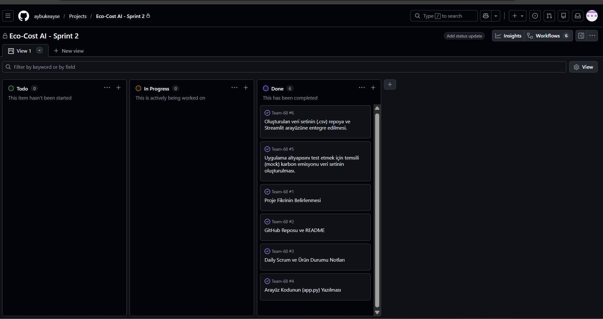
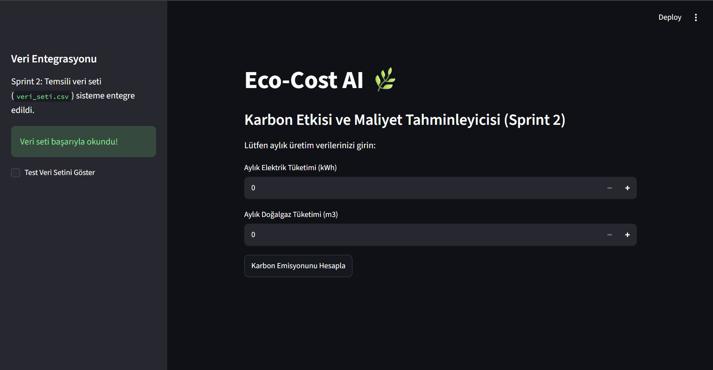

# Team-68

## Takım Elemanları: 

*Product Owner: Aybüke Hamzaçebi
*Scrum Master: Aybüke Hamzaçebi 
*Developer: Aybüke Hamzaçebi

## Ürün İsmi:
*Eco-Cost AI 

## Ürün Açıklaması:
*Eco-Cost AI, şirketlerin üretim verilerine dayanarak gelecekteki karbon emisyonlarını ve olası karbon vergisi/ceza maliyetlerini tahmin eden makine öğrenmesi destekli bir veri panelidir.

## Ürün Özellikleri:

* İşletmelerin aylık enerji (elektrik, doğalgaz vb.) tüketim verilerini sisteme girebilmesi
* Girilen veriler üzerinden anlık karbon ayak izi (emisyon) hesaplaması ve gösterimi
* Emisyon limitleri aşıldığında kullanıcıya otomatik risk ve dikkat uyarıları sunulması
* (Planlanan) Tahmini emisyon değerleri üzerinden olası karbon vergisi ve ceza maliyetlerinin hesaplanması

## Hedef Kitle:

* Karbon ayak izini takip etmek ve raporlamak isteyen işletmeler
* Enerji ve hammadde tüketimi yüksek olan üretim tesisleri ve fabrikalar
* Şirketlerin sürdürülebilirlik birimleri ve çevre uzmanları
* Gelecekteki olası karbon vergisi regülasyonlarına karşı finansal risk analizi yapmak isteyen mali işler yöneticileri

## Product Backlog URL:

https://github.com/users/aybukeayse/projects/1

# Sprint 1

## Backlog düzeni ve Story seçimleri:

Takımda tek kişi yer aldığı için backlog, doğrudan en temel hedef olan "çalışan bir arayüz (MVP) çıkarma" stratejisine göre düzenlenmiştir. Task'lar, veri işleme ve arayüz tasarımı adımlarına bölünerek sırayla panoya eklenmiştir.

## Daily Scrum:
Daily Scrum notları tarafımdan link olarak paylaşılmaktadır: 

[Sprint 1 Daily Scrum Notları](daily-scrum-notlari.md)

## Sprint board update:

## Ürün Durumu:
(Uygulamanın MVP çekirdek kodu `app.py` olarak depoya eklenmiştir. Arayüzün canlı ekran görüntüsü uygulamanın tam entegrasyonu sağlandığında eklenecektir.)

## Sprint Review: 
Alınan kararlar: Proje fikri ve kapsamı netleştirilmiştir. Arayüz iskeleti kurulmuştur. Geliştirmelerde bir problem görülmemiştir.

## Sprint Retrospective:
Karar alma süreci tek kişi olmanın avantajıyla çok hızlı ilerlemiştir.
Gelecek sprintlerde teknik işleri daha küçük parçalara bölerek ilerleme kararı alınmıştır.

---

# Sprint 2

**Sprint Süresi:** 6 Temmuz - 19 Temmuz 2026

## Sprint Hedefi
Eco-Cost AI sisteminin veri okuma altyapısını test etmek amacıyla temsili (mock) bir karbon emisyon veri setinin oluşturulması ve uygulamanın veri işleme altyapısına entegre edilmesi.

## Daily Scrum Notları

 Sprint 1 başarıyla teslim edildi ve geri bildirimler incelendi.
 Planlanan yapıya uygun temsili (mock) veri seti oluşturuldu.
 Veri setinin repoya entegrasyonu tamamlandı.

## Sprint Board Update
Sprint 2 için belirlenen temsili veri oluşturma ve entegrasyon görevleri başarıyla 'Done' statüsüne çekilmiştir. 
** [Sprint 2 Backlog / Pano Linki](https://github.com/users/aybukeayse/projects/1/views/1)**

## Ürün Durumu
Kullanıcı arayüzü (MVP) çalışır durumdadır. Mock veri setinin entegrasyonu ile birlikte arka plan altyapısının veri okuma kapasitesi test edilmiştir.

## Sprint Review (Değerlendirme)
Veri altyapısının test edilmesi hedefine ulaşılmıştır. Sonraki sprintte gerçek açık kaynaklı veri setlerine geçiş yapılmasına veya makine öğrenmesi modelinin (tahminleme) koda dahil edilmesine karar verilmiştir.

## Sprint Retrospective (Retro)
 Sistemi test etmek için hızlıca mock veri kullanmak zaman yönetimini çok verimli hale getirdi.

